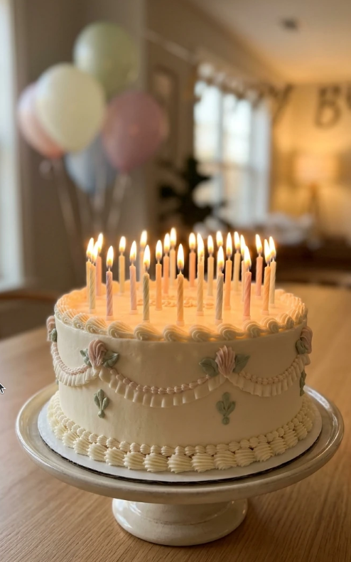

# Gut gemacht!

Die Antwort ist richtig!
Du hast die erste Quizfrage super beantwortet.
Man kann schon beinahe stolz auf Dich sein!

Hier gleich die nächste Frage:
Wieviele Kerzen sind auf der Geburtstagstorte?

<input id="footerUrl" type="text" style="display:none;"/>

Zweite Antwort:  <input type="text" id="answer" value=""/>
 <input type="button" onclick="weiter()" value="Weiter" />
