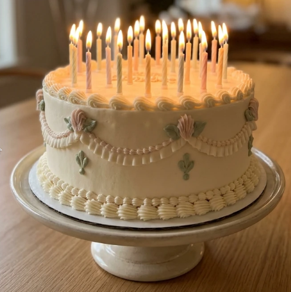

# Glückwunsch!

Herzlichen Glückwunsch, Du hast das Quiz komplett
gelöst. Damit hast Du Dir meine besten Wünsche verdient!
Und auch ein hünsches Katzenbild:

Weil beim Quiz so viele Führerscheinfragen dabei waren,
möchte ich Dir dafür etwas "Erleichterung" schenken:

Ein Führerschein ist ja sehr teuer. Man muß den Theoriekurs
bezahlen, die theoretische Prüfung, die Fahrstunden und die praktische Prüfung.
Der größte Brocken sind die Fahrstunden.
Ich schenke Dir die Kosten für alle praktischen Fahrstunden,
die Du im Jahr 2026 "nimmst". Wenn Du Dich ranhälst mit der
theoretischen Prüfung, dann können das quasi alle sein, die Du
für den Führerschein brauchst.

Viel Erfolg!
