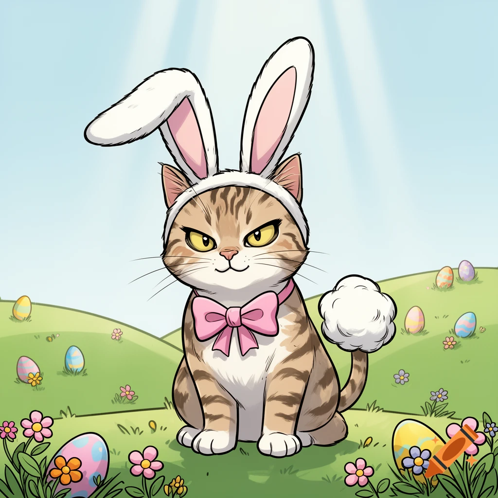

# Fünfte Aufgabe korrekt

Zum Glück haben wir ja noch ein wenig Zeit
bis dahin, die Mama ist ja jung geblieben.

# Sechste Aufgabe - Bauern und Kühe

Treffen sich Bauer Karl und Bauer Heinz.
Sie stellen fest, dass sie zusammen weniger als
10 Kühe haben. Sagt Bauer Karl: "Lieber Heinz,
wenn Du mir eine Kuh abgibst, dann haben wir gleich viele!"
Sagt Bauer Heinz: "Ne, ne! Gib lieber Du mir eine ab,
dann habe ich dreimal so viele wie Du und ich bin der Großbauer!"

Wieviele Kühe hat Kleinbauer Heinz beim Zusammentreffen?

<input id="footerUrl" type="text" style="display:none;"/>

Vierte Lösungszahl:  <input type="text" id="digits" value=""/>
 <input type="button" onclick="weiter()" value="Weiter" />
